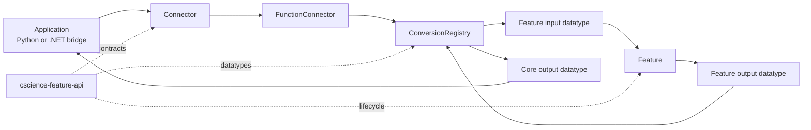
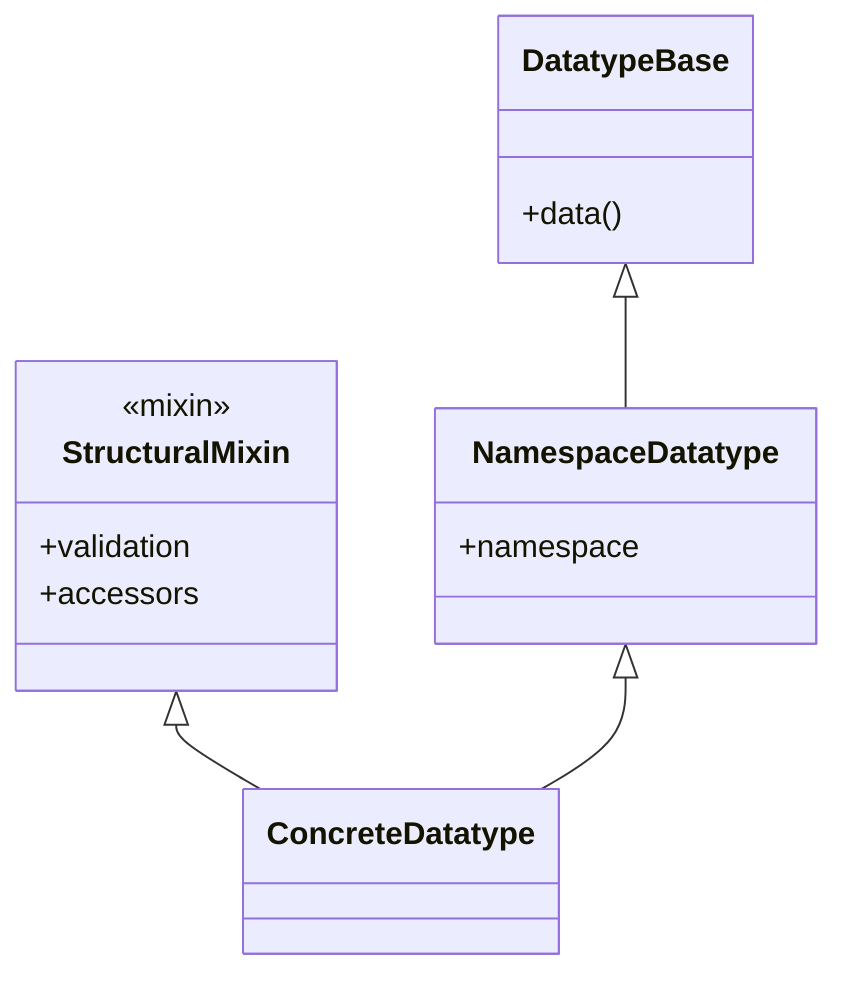
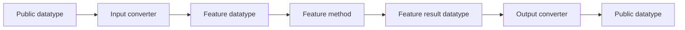

# CScience Python Features Core

A modular Python workspace for media feature extraction, datatype conversion, and connector-based integration. The workspace separates feature-independent API contracts from model-backed feature packages.

## Workspace Architecture



The API package defines the common contracts. Feature packages provide model-specific datatypes, converters, feature implementations, and public connectors.

## Packages

| Package | Namespace | Purpose |
|---|---|---|
| `cscience-feature-api` | `core` | Shared datatypes, conversion registry, connectors, configuration, and feature lifecycle |
| `cscience-feature-clip` | `clip` | OpenCLIP text and image embeddings |
| `cscience-feature-clip-spatial` | `clip_spatial` | Region-based image embeddings and text-to-region scoring |
| `cscience-feature-asr-whisper` | `asr_whisper` | Whisper speech recognition with audio decoding and resampling |
| `cscience-feature-nsfw-image` | `nsfw_image` | Image safety classification and NSFW scores |
| `cscience-feature-ocr-tesseract` | `ocr_tesseract` | Tesseract OCR for single images and batches |

Each package contains its own `README.md` with the same structure.

## Core Concepts

### Datatypes

Feature boundaries use datatype classes rather than raw Python values.



A concrete datatype combines exactly one namespace datatype with zero or more namespace-neutral structural or semantic mixins.

### Conversions

Converters are registered by feature class and source/target datatype. Lookup first checks the active feature and then falls back to core conversions.



### Feature lifecycle

`FeatureBase` creates one feature instance per configuration namespace. Configuration identity is namespace-based, allowing separate model instances such as `clip` and `clip-large`.

## Installation

The workspace requires Python 3.13.

```bash
uv sync --all-packages
```

GPU-enabled Torch packages use the configured PyTorch CUDA index on Linux and Windows. Packages that do not require Torch, such as Tesseract OCR, remain lightweight.

## Basic Usage

```python
from cscience.features.clip import ClipConnector
from cscience.features.clip.clip_config import ClipConfig

connector = ClipConnector(ClipConfig())
embedding = connector.text("a red industrial robot")
```

Use package connectors for normal Python values. Use feature classes and datatypes directly when building internal pipelines or custom conversion graphs.

## Development

Run the complete workspace test suite:

```bash
uv run pytest
```

Run one package:

```bash
uv run pytest packages/cscience-feature-clip/tests
```

Validate package documentation:

```bash
uv run python -m unittest tests.test_package_readmes
```

## Documentation Convention

Every directory under `packages/` containing a `pyproject.toml` must also contain a `README.md` with these sections:

1. Overview
2. Architecture
3. Public API
4. Datatypes
5. Configuration
6. Usage
7. Development
8. Design Notes

Use `README_TEMPLATE.md` when adding a package. The documentation test enforces file presence and section names.
