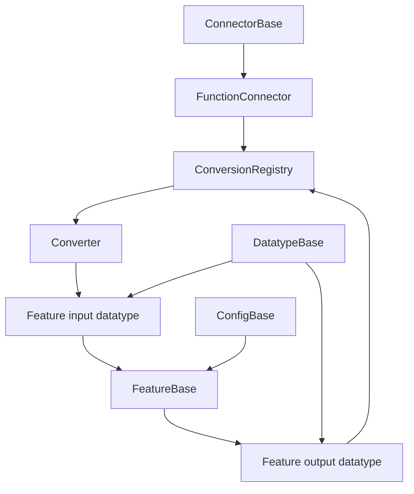
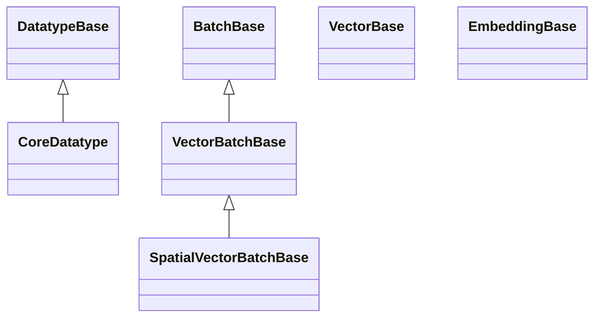

# CScience Feature API

Shared contracts for datatypes, conversion, connector composition, configuration, and feature lifecycle.

## Overview

| Property | Value |
|---|---|
| Distribution | `cscience-feature-api` |
| Namespace | `core` |
| Runtime | Pure Python with Pydantic, Pillow, and icontract |
| Entry point | Not applicable; imported by feature packages |

The package defines feature-independent media datatypes and the infrastructure used by all model-backed packages. It intentionally contains no model inference logic.

## Architecture



`FunctionConnector` wraps a unary feature method with one input conversion and one output conversion. Feature-specific converters take precedence; core converters act as fallback conversions.

## Public API

### Connector and conversion infrastructure

| Type | Purpose |
|---|---|
| `ConnectorBase` | Registers core and feature-specific conversion providers |
| `FunctionConnector` | Composes input conversion, a unary feature method, and output conversion |
| `Converter` | Typed conversion between two datatypes |
| `ConversionRegistry` | Stores converters by feature class and datatype pair |
| `SearchStrategyMostSpecific` | Resolves feature-specific converters before core fallbacks |

### Feature and configuration infrastructure

| Type | Purpose |
|---|---|
| `FeatureBase` | Singleton-per-configuration feature lifecycle |
| `ConfigBase` | Validated namespace-aware JSON configuration |
| `FeatureInfo` | Runtime feature metadata |
| `ServiceInfo` | Public connector operation metadata |

## Datatypes



| Group | Main types | Guarantee |
|---|---|---|
| Text | `Text`, `TextBatch` | Native strings with stable integer batch keys |
| Images | `ImageBytes`, `ImageDataUrl`, `PilImage`, `PilImageBatch` | Canonical encoded or decoded image representations |
| Audio | `AudioBytes`, `AudioSignal` | Encoded bytes or numeric waveform with sample rate |
| Scalars | `BoolValue`, `IntValue`, `FloatValue` | Exact native scalar types |
| Vectors | `BoolVector`, `IntVector`, `FloatVector` | Non-empty primitive vectors |
| Vector batches | `*VectorBatch` | Non-empty, uniformly sized indexed vectors |
| Spatial | `SpatialFloatVectorBatch`, `SpatialVectorBatchData` | Flat vectors with reversible item/region layout |
| References | `DataUrl`, `FilePath` | Structured data URLs and normalized filesystem paths |

Structural bases are namespace-neutral. Concrete datatypes combine them with exactly one namespace datatype.

## Configuration

`ConfigBase` supports two persistence modes:

| Mode | Path meaning | Storage |
|---|---|---|
| `CONFIG_PER_FEATURE` | Directory | `<namespace>.json` |
| `UNIFIED_CONFIG` | File | One JSON object keyed by namespace |

Configuration writes are atomic. Optional template and JSON Schema artifacts are generated in the package `resources/config` directory.

## Usage

```python
from cscience.features.api import FloatVectorBatch, TextBatch

texts = TextBatch({
    10: "first query",
    20: "second query",
})

vectors = FloatVectorBatch({
    10: [0.1, 0.2],
    20: [0.3, 0.4],
})

assert texts.ordered_keys() == (10, 20)
assert vectors.length() == 2
```

## Development

```bash
uv run pytest packages/cscience-feature-api/tests
```

The datatype architecture tests verify namespace neutrality, cooperative multiple inheritance, batch ordering, and exactly one `DatatypeBase` path.

## Design Notes

- Datatypes validate canonical boundary representations; converters perform decoding, normalization, and representation changes.
- Empty text is valid at the core level because OCR and ASR may legitimately produce it.
- `FunctionConnector` currently supports unary feature methods. Multi-input feature operations should be composed explicitly.
- Public exports in `cscience.features.api.__init__` should remain synchronized with the supported API surface.
