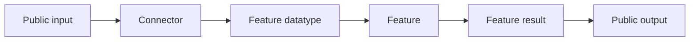

One-sentence description of the package.

## Overview

| Property | Value |
|---|---|
| Distribution | `<distribution-name>` |
| Namespace | `<namespace>` |
| Runtime | `<runtime/model>` |
| Entry point | `<entry-point>` |

State the package responsibility and its boundary.

## Architecture



Describe the central data flow in one short paragraph.

## Public API

### Connector

| Method | Input | Output | Purpose |
|---|---|---|---|
| `method(...)` | `...` | `...` | ... |

### Feature

| Method | Input datatype | Output datatype |
|---|---|---|
| `method(...)` | `...` | `...` |

## Datatypes

| Datatype | Stored representation | Guarantee |
|---|---|---|
| `ExampleDatatype` | `...` | ... |

## Configuration

| Field | Default | Meaning |
|---|---|---|
| `field` | `...` | ... |

## Usage

```python
# Minimal executable example.
```

## Development

```bash
uv run pytest packages/<package-name>/tests
```

Mention external runtime requirements or fixture constraints.

## Design Notes

- State intentional boundaries.
- Record known limitations.
- Keep configuration policy out of datatypes.
