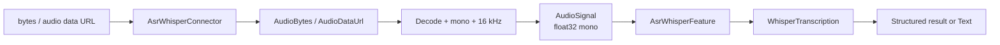

# CScience Whisper ASR Feature

Whisper speech recognition with encoded-audio conversion, mono resampling, and structured transcription output.

## Overview

| Property | Value |
|---|---|
| Distribution | `cscience-feature-asr-whisper` |
| Namespace | `asr_whisper` |
| Runtime | OpenAI Whisper, PyTorch, soundfile, librosa |
| Entry point | `asr_whisper = cscience.features.asr_whisper:register` |

The package accepts encoded audio bytes, Base64 audio data URLs, or Whisper-ready waveforms. Converters decode and normalize audio before the feature invokes Whisper.

## Architecture



Audio conversion and model inference are separate. `AudioSignal` is the canonical feature input.

## Public API

### Connector

| Method | Input | Output | Purpose |
|---|---|---|---|
| `transcribe_audio_bytes(data)` | `bytes` | `WhisperTranscriptionData` | Structured transcription |
| `transcribe_audio_data_url(data)` | `str` | `WhisperTranscriptionData` | Structured transcription from Base64 |
| `transcribe_signal(data)` | `AudioSignalData` | `WhisperTranscriptionData` | Structured transcription from canonical signal |
| `audio_bytes(data)` | `bytes` | `str` | Plain transcript |
| `audio_data_url(data)` | `str` | `str` | Plain transcript from Base64 |
| `signal(data)` | `AudioSignalData` | `str` | Plain transcript from canonical signal |

### Feature

| Method | Input datatype | Output datatype |
|---|---|---|
| `transcribe(audio)` | `AudioSignal` | `WhisperTranscription` |

## Datatypes

| Datatype | Stored representation | Guarantee |
|---|---|---|
| `AudioBytes` | non-empty `bytes` | Encoded audio in the ASR namespace |
| `AudioDataUrl` | structured `data:audio/...;base64,...` string | Base64 audio data URL |
| `AudioSignalData` | waveform plus sample rate | Compound signal data |
| `AudioSignal` | mono `np.float32` waveform at 16 kHz | Whisper-ready input |
| `WhisperTranscriptionData` | text, language, segments | Structured Whisper output |
| `WhisperTranscription` | `WhisperTranscriptionData` | Validated ASR result |

## Configuration

| Field | Default | Meaning |
|---|---|---|
| `model_name` | `small` | Whisper model; currently `small`, `medium`, or `large` |
| `preferred_device` | `cuda` | Requested inference device |
| `force_device` | `False` | Fail instead of using CPU fallback |

## Usage

```python
from pathlib import Path

from cscience.features.asr_whisper import AsrWhisperConnector
from cscience.features.asr_whisper.asr_config import AsrConfig

connector = AsrWhisperConnector(AsrConfig())
text = connector.audio_bytes(Path("speech.wav").read_bytes())
```

## Development

```bash
uv run pytest packages/cscience-feature-asr-whisper/tests
```

Integration fixtures include small public-domain excerpts from LJ Speech. Model-backed tests may download Whisper weights.

## Design Notes

- Decoding, channel reduction, dtype conversion, and resampling belong to converters.
- `AudioSignal` intentionally enforces mono `float32` audio at 16 kHz.
- Transcription segments remain flexible dictionaries because Whisper output schemas may vary.
- The service identifier is currently `asr`, while package registration and datatype namespaces use `asr_whisper`.
