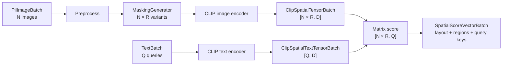

# CScience CLIP Spatial Feature

Region-based CLIP image embeddings and text-to-region similarity scoring.

## Overview

| Property | Value |
|---|---|
| Distribution | `cscience-feature-clip-spatial` |
| Namespace | `clip_spatial` |
| Runtime | OpenCLIP, PyTorch, Pillow |
| Entry point | `clip_spatial = cscience.features.clip_spatial:register` |

The package tiles each source image into configurable regions, creates masked or extracted variants, embeds every region, and preserves the mapping between flat GPU batches and logical image-region structure.

## Architecture



The physical representation is flat for GPU execution. `SpatialBatchLayout` reconstructs logical indices:

```text
flat_index <-> (item_index, region_index)
```

## Public API

### Connector

| Method | Input | Output | Purpose |
|---|---|---|---|
| `image_regions(image)` | `PIL.Image.Image` | `SpatialFloatVectorBatch` | Embed regions of one image |
| `image_region_batch(images)` | `list[PIL.Image.Image]` | `SpatialFloatVectorBatch` | Embed regions of an image batch |

The current connector exposes indexing operations. Text-to-region scoring is available on `ClipSpatialFeature`; a public multi-input connector operation is not yet implemented.

### Feature

| Method | Input datatype | Output datatype |
|---|---|---|
| `text_batch(texts)` | `TextBatch` | `ClipSpatialTextTensorBatch` |
| `image_region_batch(images)` | `PilImageBatch` | `ClipSpatialTensorBatch` |
| `score_embeddings(text_vectors, spatial_vectors)` | two feature datatypes | `SpatialScoreVectorBatch` |
| `score_text_vector_batch(texts, spatial_vectors)` | `TextBatch` plus spatial embeddings | `SpatialScoreVectorBatch` |
| `score_text_image_batch(texts, images)` | `TextBatch` plus `PilImageBatch` | `SpatialScoreVectorBatch` |

## Datatypes

| Datatype | Stored representation | Guarantee |
|---|---|---|
| `ClipSpatialTensorBatch` | flat `dict[int, Tensor[D]]` plus layout | Spatial image-region embeddings |
| `ClipSpatialTextTensorBatch` | keys plus packed `Tensor[Q, D]` | Text embeddings with stable query keys |
| `SpatialScoreVectorBatch` | `dict[flat_region, list[score]]` | One score per query for every region |
| `SpatialVectorBatchData` | vectors, layout, item keys, regions | Reversible flat-to-structured mapping |
| `SpatialRegion` | pixel and normalized bounds | Region geometry and grid position |

For `N` images, `R` regions, embedding dimension `D`, and `Q` queries:

```text
image embeddings: [N × R, D]
text embeddings:  [Q, D]
scores:           [N × R, Q]
```

## Configuration

| Field | Default | Meaning |
|---|---|---|
| `model_name` | `xlm-roberta-base-ViT-B-32` | OpenCLIP model architecture |
| `pretrained` | `laion5b_s13b_b90k` | Pretrained checkpoint |
| `preferred_device` | `cuda` | Requested inference device |
| `force_device` | `False` | Fail instead of falling back |
| `grid_shape` | `(5, 7)` | Region rows and columns |
| `start_point` | `(1/6, 1/8)` | Normalized first region center |
| `step_size` | `(1/6, 1/8)` | Normalized center displacement |
| `geometry_size` | `(1/3, 1/4)` | Relative region height and width |
| `masking_mode` | `KEEP_ONLY` | `MASK_OUT`, `KEEP_ONLY`, or `EXTRACT` |

## Usage

```python
from PIL import Image

from cscience.features.api import PilImageBatch, TextBatch
from cscience.features.clip_spatial.clip_spatial_config import ClipSpatialConfig
from cscience.features.clip_spatial.clip_spatial_feature import ClipSpatialFeature

feature = ClipSpatialFeature.get_instance(ClipSpatialConfig())

scores = feature.score_text_image_batch(
    texts=TextBatch({
        100: "red object",
        200: "round object",
    }),
    images=PilImageBatch({
        10: Image.open("scene.png").convert("RGB"),
    }),
)

region_scores = scores.vector_at(item_index=0, region_index=0)
```

## Development

```bash
uv run pytest packages/cscience-feature-clip-spatial/tests
```

Fast scoring and datatype tests do not require model initialization. Integration tests may download model weights and use GPU acceleration.

## Design Notes

- Grid, geometry, masking mode, model, and device remain configuration concerns.
- Datatypes preserve produced structure but do not decide how regions are generated.
- Scores are not restricted to `[0, 1]`; normalized CLIP dot products may be negative.
- `FunctionConnector` is unary, so multi-input scoring should be exposed through explicit connector composition.
- The namespace base belongs in `clip_spatial_datatypes/clip_spatial_datatype.py`; the obsolete top-level duplicate should be removed.
