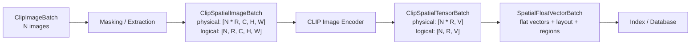
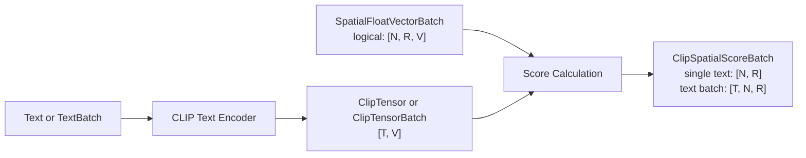
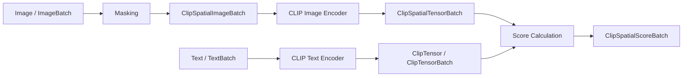

# Clip Spatial Feature Extraction


$$
\begin{align}
N &= \text{number of source images} \\
R &= \text{number of regions per image} \\
V &= \text{embedding vector length, e.g. 512} \\
C &= \text{channels} \\
H &= \text{image height} \\
W &= \text{image width} \\
T &= \text{number of text queries}
\end{align}
$$

For a single image with a 3×3 grid:


$$
\begin{align}
N = 1
R = 9
\end{align}
$$

For an image batch of 16 images with a 3×3 grid:

$$
\begin{align}
N = 16
R = 9
N * R = 144 masked image variants
\end{align}
$$


The GPU wants the flat form:

$$ [N * R, C, H, W] $$

But the application wants the structured form:

$$ [N, R, C, H, W] $$


# CLIP Spatial Datatypes

## Core Idea

CLIP Spatial needs special datatypes only where a flat batch has hidden spatial structure.

A normal CLIP batch has shape:

```text
[B, V]
```

A spatial CLIP batch has logical shape:

```text
[N, R, V]
```

but is processed physically as:

```text
[N * R, V]
```

where:

```text
N = number of source images
R = number of regions per image
V = embedding vector length
```

The datatype must guarantee the mapping:

```text
flat_index <-> (image_index, region_index)
```

## Datatypes

Reuse existing CLIP/core datatypes:

```text
ClipImage
ClipImageBatch
Text
TextBatch
ClipTensor
ClipTensorBatch
FloatVector
FloatVectorBatch
```

Add spatial datatypes:

```text
ClipSpatialBatchLayout
ClipSpatialRegion
ClipSpatialImageBatch
ClipSpatialTensorBatch
SpatialFloatVectorBatch
ClipSpatialScoreBatch
```

## Indexing Pipeline



## Retrieval Pipeline



## Direct Image Retrieval



## Design Rule

The config stays in the config file.

Datatypes should not decide masking mode, grid size, model name, or device.
They should only preserve the actual produced structure:

```text
layout
regions
tensor/vector data
```

## Important Guarantee

`ClipSpatialBatchLayout` must guarantee:

```text
flat_count = image_count * regions_per_image
flat_index = image_index * regions_per_image + region_index
```

This allows efficient GPU batching while preserving the spatial structure needed for indexing, retrieval, and score interpretation.
