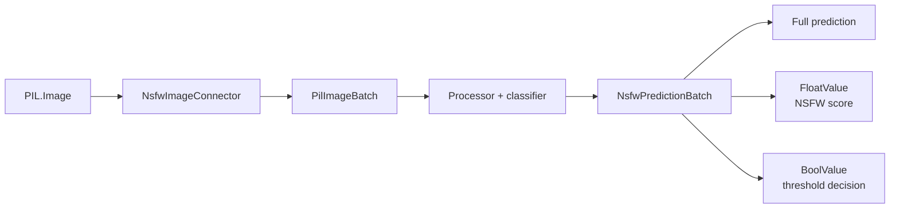

# CScience NSFW Image Feature

Image safety classification with structured class probabilities, scalar scores, and threshold decisions.

## Overview

| Property | Value |
|---|---|
| Distribution | `cscience-feature-nsfw-image` |
| Namespace | `nsfw_image` |
| Runtime | Hugging Face Transformers and PyTorch |
| Entry point | `nsfw_image = cscience.features.nsfw_image:register` |

The package classifies Pillow images using a two-class image model and preserves the predicted label, predicted confidence, normal score, and NSFW score.

## Architecture



The feature always produces structured predictions. Converters derive simpler public views.

## Public API

### Connector

| Method | Input | Output | Purpose |
|---|---|---|---|
| `classify(image)` | `PIL.Image.Image` | `NsfwPredictionData` | Full single-image prediction |
| `classify_batch(images)` | `list[PIL.Image.Image]` | `dict[int, NsfwPredictionData]` | Indexed batch predictions |
| `score(image)` | `PIL.Image.Image` | `float` | NSFW probability |
| `is_nsfw(image, threshold)` | image plus threshold | `bool` | Caller-defined threshold |
| `is_nsfw_default(image)` | `PIL.Image.Image` | `bool` | Default threshold conversion |

### Feature

| Method | Input datatype | Output datatype |
|---|---|---|
| `classify_batch(images)` | `PilImageBatch` | `NsfwPredictionBatch` |

## Datatypes

| Datatype | Stored representation | Guarantee |
|---|---|---|
| `NsfwPredictionData` | label and three float scores | Structured classification result |
| `NsfwPrediction` | `NsfwPredictionData` | Native floats in `[0, 1]` |
| `NsfwPredictionBatchData` | indexed predictions | Compound batch representation |
| `NsfwPredictionBatch` | `NsfwPredictionBatchData` | Non-empty validated batch |

## Configuration

| Field | Default | Meaning |
|---|---|---|
| `model_name` | `Falconsai/nsfw_image_detection` | Hugging Face model |
| `preferred_device` | `cuda` | Requested inference device |
| `force_device` | `False` | Fail instead of using CPU fallback |

## Usage

```python
from PIL import Image

from cscience.features.nsfw_image import NsfwImageConnector
from cscience.features.nsfw_image.nsfw_config import NsfwConfig

connector = NsfwImageConnector(NsfwConfig())
prediction = connector.classify(
    Image.open("image.png").convert("RGB")
)

print(prediction.label, prediction.nsfw_score)
```

## Development

```bash
uv run pytest packages/cscience-feature-nsfw-image/tests
```

Model-backed tests may download processor and classifier weights from Hugging Face.

## Design Notes

- Prediction datatypes validate probability ranges but do not require scores to sum exactly to one.
- Threshold policy remains a caller concern except for the explicit default conversion.
- The model must expose labels named `normal` and `nsfw`.
- `NsfwConfig` currently defaults to namespace `nsfw`, while registration and datatype namespaces use `nsfw_image`; these should be aligned before the namespace is treated as stable.
