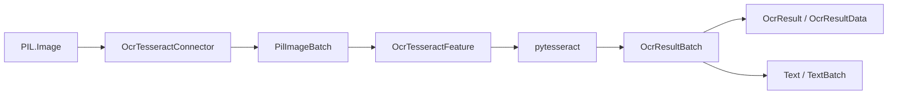

# CScience Tesseract OCR Feature

Tesseract OCR for Pillow images with structured and plain-text connector outputs.

## Overview

| Property | Value |
|---|---|
| Distribution | `cscience-feature-ocr-tesseract` |
| Namespace | `ocr_tesseract` |
| Runtime | pytesseract and the external Tesseract executable |
| Entry point | `ocr_tesseract = cscience.features.ocr_tesseract:register` |

The package runs OCR independently for every image in an indexed batch. Empty OCR text is valid and preserves alignment with source image keys.

## Architecture



Structured OCR results are the canonical feature output. Converters expose plain text when metadata is not required.

## Public API

### Connector

| Method | Input | Output | Purpose |
|---|---|---|---|
| `extract(image)` | `PIL.Image.Image` | `OcrResultData` | Structured single result |
| `extract_batch(images)` | `list[PIL.Image.Image]` | `dict[int, OcrResultData]` | Structured batch results |
| `text(image)` | `PIL.Image.Image` | `str` | Plain OCR text |
| `text_batch(images)` | `list[PIL.Image.Image]` | `dict[int, str]` | Indexed plain-text results |

### Feature

| Method | Input datatype | Output datatype |
|---|---|---|
| `extract_text_batch(images)` | `PilImageBatch` | `OcrResultBatch` |

## Datatypes

| Datatype | Stored representation | Guarantee |
|---|---|---|
| `OcrResultData` | `text: str` | Structured result for one image |
| `OcrResult` | `OcrResultData` | Validated OCR result |
| `OcrResultBatchData` | indexed results | Compound batch representation |
| `OcrResultBatch` | `OcrResultBatchData` | Non-empty batch with integer source keys |

## Configuration

`OcrConfig` currently has no feature-specific fields. It still provides namespace identity and the persistence behavior inherited from `ConfigBase`.

## Usage

```python
from PIL import Image

from cscience.features.ocr_tesseract import OcrTesseractConnector
from cscience.features.ocr_tesseract.ocr_config import OcrConfig

connector = OcrTesseractConnector(OcrConfig())
text = connector.text(
    Image.open("document.png").convert("RGB")
)
```

## Development

```bash
uv run pytest packages/cscience-feature-ocr-tesseract/tests
```

The Tesseract executable must be installed and discoverable by `pytesseract`. Tests should skip cleanly when the executable is unavailable.

## Design Notes

- Empty strings are valid OCR results.
- Tesseract runtime configuration is deferred because no model loading is required.
- Image preprocessing and language-specific options are not yet represented in `OcrConfig`.
- Batch ordering follows ascending source keys through `BatchBase`.
